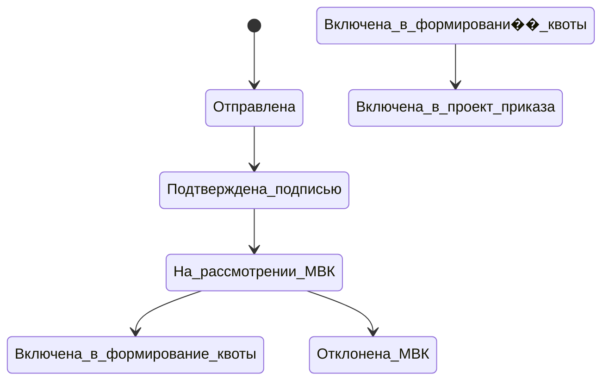

# Квоты

Квоты — обязательное разрешение на привлечение иностранной рабочей силы для определённых (защищённых) должностей. Этап квотирования предшествует основному оформлению в [[Этапы оформления РНР]] и влияет на сроки [[Pipeline сделки]].

## Когда нужны квоты

Около **40 должностей** подпадают под квотирование. Если должность из [[Заявка|заявки]] входит в перечень — необходимо получить квоту. Если не входит — этап пропускается, и процесс переходит к следующей стадии.

## Процесс получения

1. Подача заявки через портал **migrakvota.gov.ru**
2. Параллельная подача бумажной копии в ДТСЗН (Департамент труда и социальной защиты населения)
3. Рассмотрение заявки комиссией
4. Получение решения (одобрение / отказ)

## Сроки

| Параметр | Значение |
|----------|----------|
| Минимальный срок | 1 месяц |
| Максимальный срок | 6 месяцев |
| Зависит от | должности, региона, загрузки комиссии |

Этот этап — один из самых длительных в процессе, существенно влияющий на [[SLA и светофор|общие сроки]] оформления.

## Отказ по квоте

Обработка отказа — **открытый вопрос**. Возможные сценарии:
- Повторная подача с корректировкой
- Смена должности на неквотируемую
- Отмена заявки

## Статусная модель квотной заявки

Статусы переключаются **вручную администратором** — автоматической интеграции нет (6.1, 6.8). Killer feature.

## Управление квотным процессом

### Администратор
- Создание и редактирование чеклиста этапов квотного процесса (6.3–6.4)
- Настройка ключевых дат и дедлайнов по каждому статусу (6.5)
- Загрузка инструкции для каждого этапа (6.6)
- Загрузка шаблона документа для каждого этапа (6.7)
- Ручная смена статуса квотной заявки (6.8)

> [!question] Уточнить точный перечень этапов чеклиста квотного процесса (6.3)

> [!question] Получить примеры документов для квотного процесса (6.7)

### Клиент

**Пошаговый гайд по получению квоты** (killer feature):
- **Вариант 1** — подача через МФЦ (6.9)
- **Вариант 2** — подача с ЭЦП (6.10)

> [!question] Как клиент выбирает нужный вариант? Можно ли определить автоматиче��ки? (6.9)

**Чеклист типичных ошибок** при заполнении заявки на квоту (killer feature) (6.11)

> [!question] Уточнить точный перечень типичных ошибок (6.11)

- Отслеживание текущего статуса квотной заявки (6.12)
- Просмотр ключевых дат и дедлайнов (6.13)
- Инструкция по публикации вакансии на портале «Работа в России» (trudvsem.ru) (6.14)
- Хранение документов квотного дела (nice to have) (6.15)

> [!question] Инструкция по trudvsem.ru — только информационная или планируется интеграция с API? (6.14)

## Уведомления

Клиент получает уведомление при каждой смене статуса квотной заявки (6.2).
