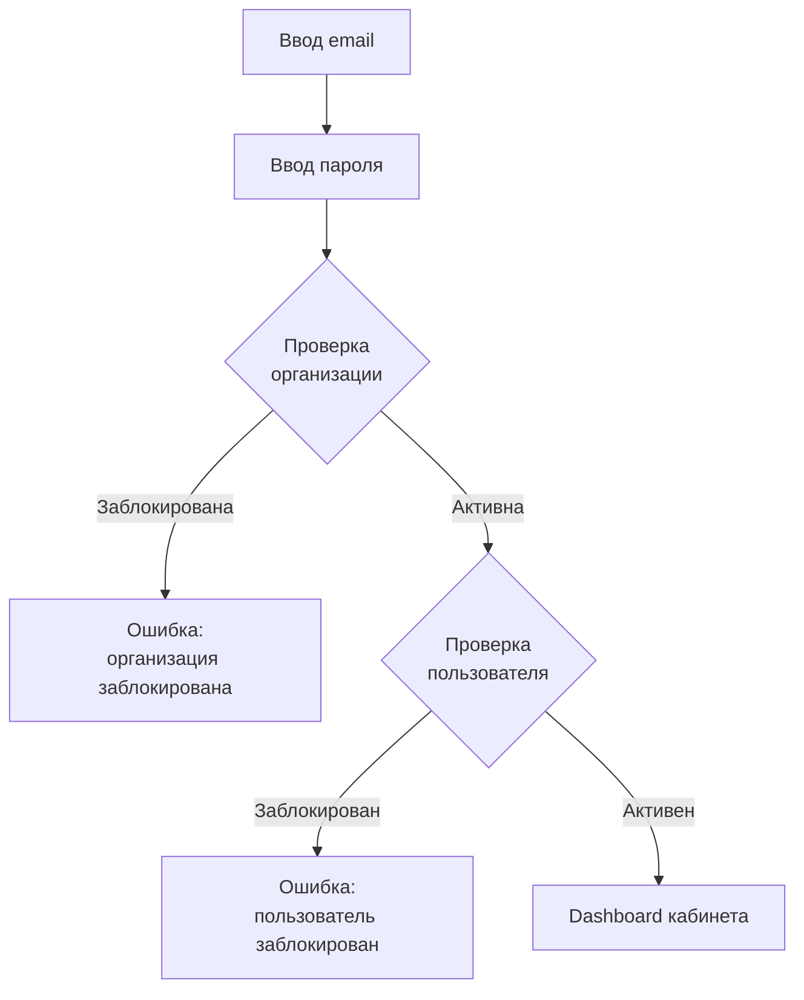
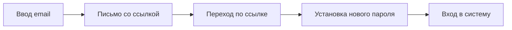

# Авторизация

## MVP: Email + пароль

**Порядок проверок:**
1. Валидация email + пароль
2. Проверка статуса организации (если заблокирована — отказ)
3. Проверка статуса пользователя (если заблокирован — отказ)
4. Успешный вход → перенаправление в соответствующий кабинет (см. [[Кабинеты]])

## Первый вход

- После перехода по ссылке-приглашению пользователь **обязан сменить пароль**.
- Вход без смены пароля невозможен.

## Восстановление пароля

- Ссылка одноразовая, с ограниченным сроком действия.
- При неверном email — **не** сообщаем об отсутствии аккаунта (безопасность).

## Управление сессиями

- Сессия имеет TTL (время жизни).
- При бездействии — автоматический выход.
- Возможен принудительный выход из всех сессий (через профиль или по блокировке).

## SberID (OAuth 2.0 / OIDC)

**Приоритет:** key feature

Авторизация через SberID доступна для менеджеров клиента и рекрутеров российского партнёра (1.3). Интеграция через OAuth 2.0 / OIDC — см. [[Интеграции]].

## SMS-авторизация кандидата

Кандидат авторизуется по SMS-коду. Первичная авторизация происходит при переходе по реферральной ссылке от индийского партнёра с подтверждением согласия на обработку ПД (1.4). Подробнее — [[Регистрация]].

## Ограничения

- **Один аккаунт = одна организация** (1.11). Для работы в другой организации необходим отдельный email и аккаунт.
- **Мультиролевая модель доступа:** client, admin, india_partner, russia_partner, candidate (1.7)
- **Журнал событий аутентификации** — nice to have (1.12)

## Связи

- Процесс регистрации — [[Регистрация]]
- Кабинеты по ролям — [[Кабинеты]]
- SberID интеграция — [[Интеграции]]
