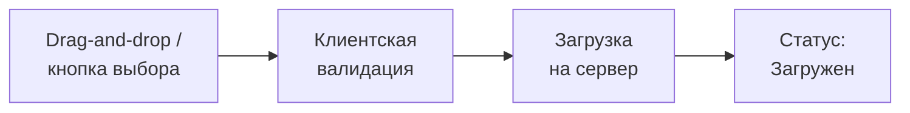
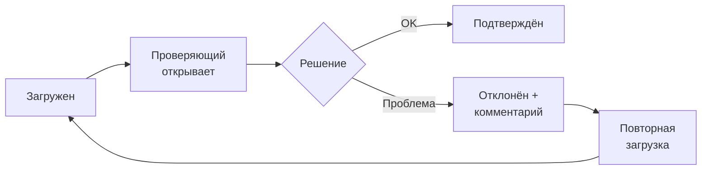
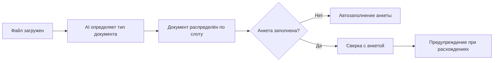

# Загрузка документов

Универсальный процесс, используемый во всех кабинетах платформы.

## Процесс загрузки

**Клиентская валидация:**
- Формат: изображения (JPG, PNG), PDF, DOCX
- Размер: ограничение на файл (настраивается)
- При ошибке — сообщение без отправки на сервер

## Процесс проверки

- **Подтверждён** — документ принят, дальнейшие действия не требуются.
- **Отклонён** — обязателен комментарий с причиной. Загрузчик получает уведомление и может повторно загрузить исправленный документ.

## AI-обработка при загрузке кандидата

Для документов кандидата в новой версии требований добавлена AI/ML-логика (3.33):

- Если анкета кандидата не заполнена, данные из документа используются для её автозаполнения.
- Если анкета уже есть, данные документа сверяются с анкетой.
- При несоответствии система показывает предупреждение, но не подменяет решение пользователя автоматически.

## Проверяющие по типам документов

| Тип документа | Кто проверяет |
|---------------|---------------|
| Документы кандидата (резюме, паспорт) | Партнёр РФ |
| КП | Админ |
| Документы оформления (РНР, виза и т.д.) | Партнёр РФ |
| Чек-лист документы (ИНН, СНИЛС и т.д.) | Партнёр РФ |

## Версионность

- Каждая загрузка сохраняется как новая версия.
- Доступна полная история: кто загрузил, когда, какой статус, комментарии.
- Актуальной считается последняя версия.

## Статусы документа

`Не загружен` → `Загружен` → `Подтверждён` / `Отклонён` → (при перезагрузке) `Загружен` → ...

Для части кандидатских документов в операционном сценарии используется также упрощённая модель `Ожидает загрузки → Загружен / Сгенерирован` (8.2).

## Связи

- Сущность — [[Документы]]
- Используется в чек-листе — [[Чек-лист оформления]]
