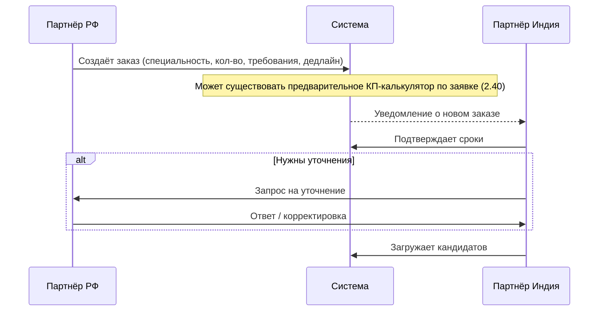
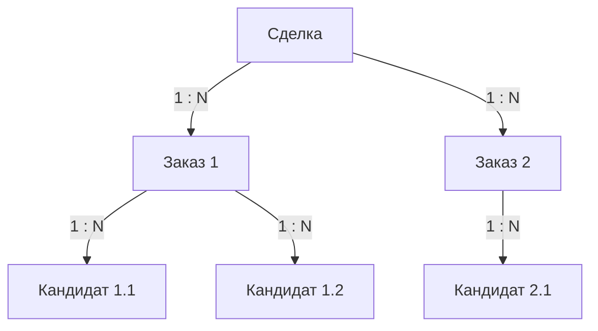

# Передача задачи Индии

## Процесс

## Параметры заказа

- **Специальность** — конкретная профессия / навык
- **Количество** — сколько специалистов требуется
- **Требования** — опыт, квалификация, языки
- **Дедлайн** — ожидаемый срок подбора

Источник данных для заказа — структурированная форма [[Бриф|заявки клиента]]. Отдельный file-brief не является обязательным входом.

## Структура данных

- **Сделка** (1) → **Заказы** (много) — разные специальности в рамках одной сделки.
- **Заказ** (1) → **Кандидаты** (много) — несколько кандидатов на одну позицию.

## Автоматическое создание задачи

При **запросе замены** клиентом (см. [[Согласование кандидата]]) система автоматически создаёт новый заказ для Партнёра Индия с параметрами исходного заказа.

## Взаимодействие

- Партнёр Индия может запрашивать уточнения через комментарии к заказу.
- Партнёр РФ видит статус выполнения заказа и количество предложенных кандидатов.
- Дедлайн фиксируется после подтверждения Партнёром Индия.

## Связи

- Место в pipeline — [[Pipeline сделки]]
- Кандидаты — [[Кандидат]]
