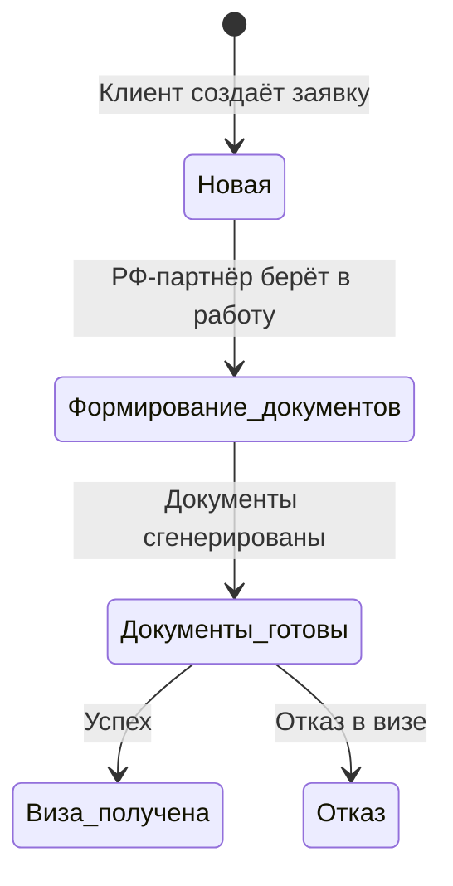

# Продление визы

Процесс продления рабочей визы для [[Кандидат|кандидатов]] со статусом «Принят на работу». Инициируется [[Роли и суброли|клиентом]], исполняется [[Роли и суброли|российским партнёром]].

## Статусная модель

| Статус | Описание |
|--------|----------|
| Новая | Клиент создал заявку на продление (11.6) |
| Формирование документов | РФ-партнёр вводит данные и генерирует пакет (11.11–11.12) |
| Документы готовы | Документы сформированы, ожидание результата (11.13) |
| Виза получена | Кандидат получил визу (11.15) |
| Отказ | Отказ в визе с указанием причины (11.16) |

## Действия по ролям

### Клиент

- Просмотр списка кандидатов со статусом «Принят на работу», для которых доступно продление (11.5)
- Создание заявки на продление визы для конкретного кандидата (11.6)
- Отслеживание текущего статуса заявки (11.7)
- Просмотр сформированных документов (11.8)

### Российский партнёр

- Просмотр входящих заявок на продление визы (11.9)
- Просмотр карточки кандидата и данных текущей визы (11.10)
- Ввод дополнительных данных для формирования документов (11.11)
- Генерация пакета документов по шаблону (11.12)
- Скачивание сгенерированных документов (11.13)
- Отправка кандидату SMS с инструкцией о следующих шагах (11.14)
- Отметка о получении визы или отказе (11.15–11.16)

> [!question] Получить примеры документов для продления визы (11.12)

### Кандидат

- Просмотр статуса заявки на продление в [[Кабинет кандидата|личном кабинете]] (11.17)
- Просмотр подготовленных документов (11.18)

> [!question] Что видит кандидат в личном кабинете во время процесса продления визы? (11.9)

## Уведомления

| Событие | Получатель | Канал |
|---------|-----------|-------|
| Создание заявки на продление | Российский партнёр | Email (11.2) |
| Смена статуса заявки | Клиент | Email (11.3) |
| Смена статуса заявки | Кандидат | SMS (11.4) |

## Связанные статьи

- [[Кандидат]] — статусная модель и жизненный цикл
- [[Чек-лист оформления]] — первичное оформление документов
- [[Пакеты услуг]] — продление визы в составе Premium-пакета
- [[Кабинет кандидата]] — отображение статуса визы
