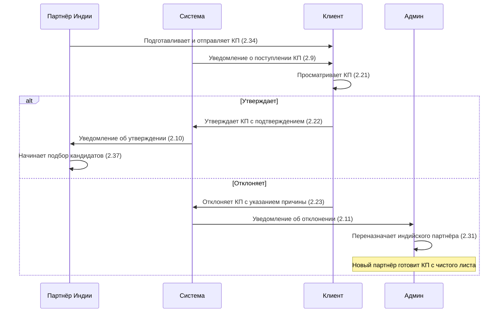

# Работа с КП

Часть этапа **Пресейл** в [[Pipeline сделки]].

## Процесс (ФТ v2)

По функциональным требованиям КП готовит **индийский партнёр**. Клиент напрямую утверждает или отклоняет КП.

> [!question] Уточнить процесс: есть ли шаг с КП для всех заявок? (2.1)

## Статусы КП

| Статус | Описание |
|--------|----------|
| **На рассмотрении** | КП отправлено клиенту (2.35) |
| **Утверждено** | Клиент одобрил КП (2.35) |
| **Отклонено** | Клиент отклонил с указанием причины (2.35–2.36) |

## Ключевые правила

- **Индийский партнёр** подготавливает и отправляет КП по заявке клиенту (2.34)
- **Клиент** утверждает или отклоняет КП напрямую (2.22–2.23)
- **Администратор** переназначает партнёра при отклонении КП (2.31)
- Индийский партнёр видит причину отклонения (2.36)
- Данные отстранённого партнёра доступны в режиме «только чтение» (2.32)

## Связи

- Сущность — [[Коммерческое предложение]]
- Место в pipeline — [[Pipeline сделки]]
