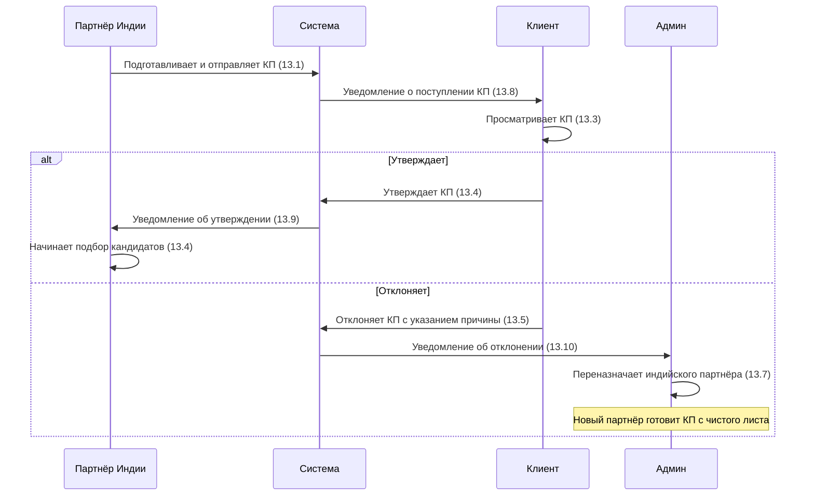

# Работа с КП

Часть этапа **Пресейл** в [[Pipeline сделки]].

> [!info] Wave 4
> Работа с КП (требования 13.1–13.14 ФТ от 9.04) вынесена в **Wave 4** (post-MVP). В v1 подбор кандидатов начинается сразу после нажатия «Взял в работу» (п. 2.33) — без предварительного согласования КП у клиента.

## Архитектура Wave 4

В Wave 4 процесс КП включает:

| Действие | Роль | Требование |
|----------|------|------------|
| Формирование КП (стоимость, состав услуг, SLA) | Партнёр Индии | 13.1 |
| Просмотр статуса КП партнёром | Партнёр Индии | 13.2 |
| Уведомление клиента о поступлении КП | Система | 13.8 |
| Уведомление индийского партнёра об утверждении КП | Система | 13.9 |
| Уведомление администратора об отклонении КП | Система | 13.10 |
| Просмотр КП клиентом | Клиент | 13.3 |
| Утверждение КП клиентом | Клиент | 13.4 |
| Отклонение КП клиентом с указанием причины | Клиент | 13.5 |
| Переназначение партнёра при отклонении КП | Администратор | 13.7 |
| Калькулятор КП (предварительная ориентировочная стоимость) | Система | 13.11 |
| Статус заявки «КП на рассмотрении» | Система | 13.12 |
| **Подписание договора через ЭДО** | Система | 13.13 |
| **Акцепт договора через ЭДО** | Система | 13.14 |

## Процесс Wave 4



## Статусы КП (Wave 4)

| Статус | Описание |
|--------|----------|
| **На рассмотрении** | КП отправлено клиенту (13.6) |
| **Утверждено** | Клиент одобрил КП (13.6) |
| **Отклонено** | Клиент отклонил с указанием причины (13.6) |

## ЭДО-подписание (Wave 4)

В Wave 4 добавлена возможность электронного документооборота (требования 13.13–13.14):

- **Подписание договора** — клиент подписывает договор через ЭДО-систему (13.13)
- **Акцепт договора** — клиент подтверждает акцептом (13.14)

> [!question] Требуется уточнение
> Какой конкретный ЭДО-провайдер использовать (Диадок, СБИС, Тензор)? Есть ли юридическое ограничение на акцепт для индийских контрагентов? (13.13–13.14)

## v1 — упрощённый процесс

В v1 этап КП пропускается:

```
Заявка создана → Назначены партнёры → Индийский партнёр нажимает «Взял в работу» → Начинается подбор
```

Клиент не согласовывает КП. Подбор кандидатов начинается сразу после принятия заявки индийским партнёром.

## Связи

- Сущность — [[Коммерческое предложение]]
- Место в pipeline — [[Pipeline сделки]]
- Статусная модель заявки — [[Статусная модель заявки]]
