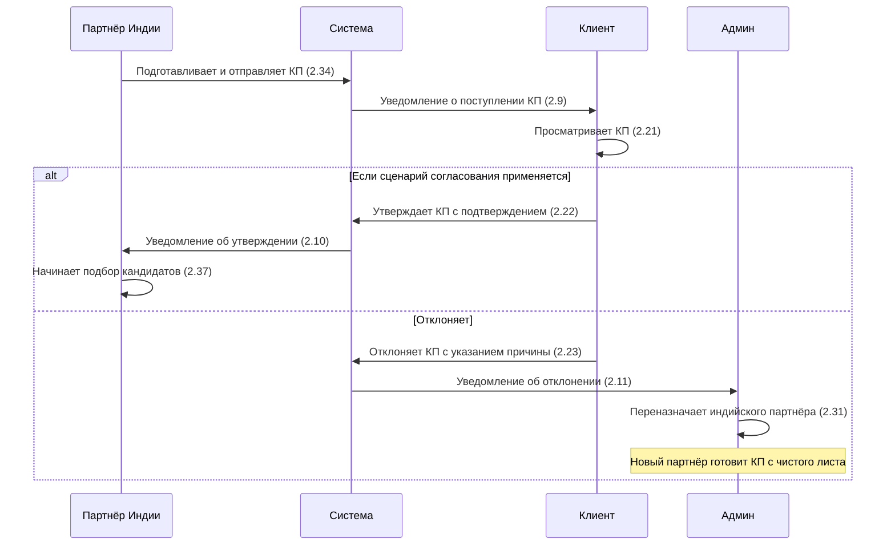

# Работа с КП

Часть этапа **Пресейл** в [[Pipeline сделки]].

## Что точно подтверждено ФТ от 6 апреля

По функциональным требованиям:

- КП готовит **индийский партнёр** (2.34)
- клиент получает уведомление о поступлении КП (2.9)
- клиент может просмотреть КП (2.21)
- в требованиях перечислены действия утверждения и отклонения (2.22–2.23)
- при отклонении администратор получает уведомление и может переназначить индийского партнёра (2.11, 2.31)

> [!question] Уточнить процесс: есть ли шаг с КП для всех заявок? (2.1)
> [!question] Есть ли вообще отдельный обязательный процесс согласования КП, или часть пунктов 2.9–2.11 и 2.21–2.23 описывает только один из сценариев? 

## Статусы КП

| Статус | Описание |
|--------|----------|
| **На рассмотрении** | КП отправлено клиенту (2.35) |
| **Утверждено** | Клиент одобрил КП (2.35) |
| **Отклонено** | Клиент отклонил с указанием причины (2.35–2.36) |

## Ключевые правила

- **Индийский партнёр** подготавливает и отправляет КП по заявке клиенту (2.34)
- **Клиент** может утверждать или отклонять КП напрямую, если этот сценарий подтверждён для конкретного типа заявки (2.22–2.23)
- **Администратор** переназначает партнёра при отклонении КП (2.31)
- Индийский партнёр видит причину отклонения (2.36)
- Данные отстранённого партнёра доступны в режиме «только чтение» (2.32)

## Связи

- Сущность — [[Коммерческое предложение]]
- Место в pipeline — [[Pipeline сделки]]
