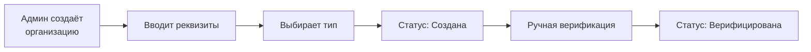
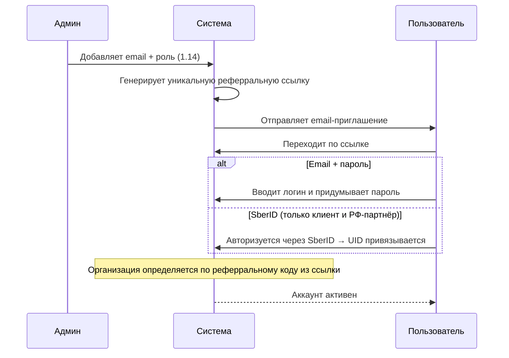
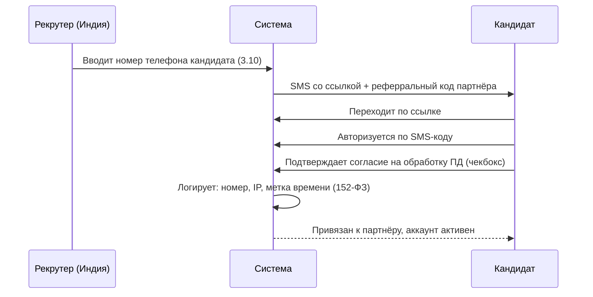

# Регистрация

## Регистрация организации

**Типы организаций:**
- Клиент
- Партнёр РФ
- Партнёр Индия

**Статусы организации:** `Создана` → `Верифицирована` → (опционально) `Заблокирована`

> В MVP верификация ручная — админ проверяет реквизиты и подтверждает.

## Добавление пользователей (менеджеры, рекрутеры)

- Админ указывает **email** и **роль** пользователя (1.14, см. [[Роли и суброли]])
- Система генерирует **уникальную реферральную ссылку** для конкретного пользователя (1.5)
- Ссылка одноразовая, срок действия — 24 часа (1.6)
- Пользователь выбирает способ входа: email+пароль или SberID (только для клиента и РФ-партнёра) (1.5)
- Ограничение: **один аккаунт = одна организация** (1.11)

> [!question] Уточнить срок действия реферральной ссылки (24 часа) и поведение при повторном переходе по использованной ссылке (1.6)

## Регистрация кандидата

Текст согласия на обработку ПД управляется администратором в [[Глобальные настройки|глобальных настройках]] (10.6).

## Edge cases

| Сценарий | Поведение |
|----------|-----------|
| **Повторная отправка приглашения** | Админ может переотправить письмо; старая ссылка инвалидируется |
| **Блокировка организации** | Все пользователи организации теряют доступ к системе |
| **Блокировка пользователя** | Только конкретный пользователь теряет доступ; остальные в организации — без изменений |
| **Приглашение не принято** | Ссылка одноразовая, 24 часа; после истечения требуется переотправка (1.6) |
| **Повторная отправка / сброс пароля** | Админ отправляет новое приглашение с новой ссылкой (1.15) |
| **Удаление сотрудника** | Админ удаляет пользователя из организации (1.16) |

## Связи

- Сущность — [[Организация]]
- Система ролей — [[Роли и суброли]]
- Вход в систему — [[Авторизация]]
