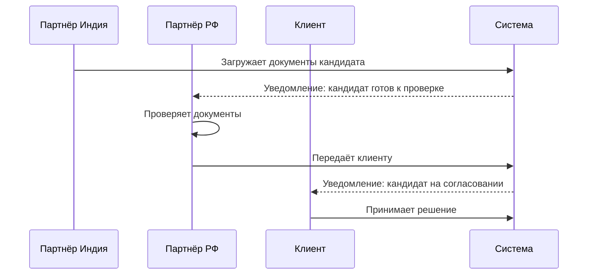
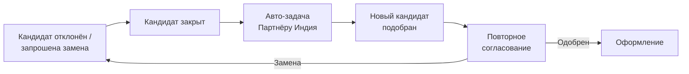

# Согласование кандидата

## Последовательность действий

## Три исхода

| Решение | Действие | Результат |
|---------|----------|-----------|
| **Одобрить** | Клиент нажимает «Одобрить» | Кандидат переходит в статус `approved`, начинается оформление |
| **Отклонить** | Клиент нажимает «Отклонить» + указывает причину | Терминальный статус `rejected`, причина сохраняется в истории |
| **Запросить замену** | Клиент нажимает «Запросить замену» | Текущий кандидат закрывается, система создаёт авто-задачу для Индии |

> **Причина отклонения обязательна** — без заполнения поля кнопка «Отклонить» неактивна.

## Цикл замены

Цикл повторяется до тех пор, пока клиент не одобрит кандидата или не отменит заявку.

## Что видит клиент

- Карточка кандидата с загруженными документами (резюме, фото, копия паспорта и др.)
- Три кнопки действий
- История предыдущих кандидатов по данной заявке (если были замены)

## Что видит Партнёр РФ

- Статус согласования в реальном времени
- Комментарий клиента при отклонении
- Возможность добавить свой комментарий перед передачей клиенту

## Связи

- Сущность — [[Кандидат]]
- Полная карта статусов — [[Статусная модель кандидата]]
