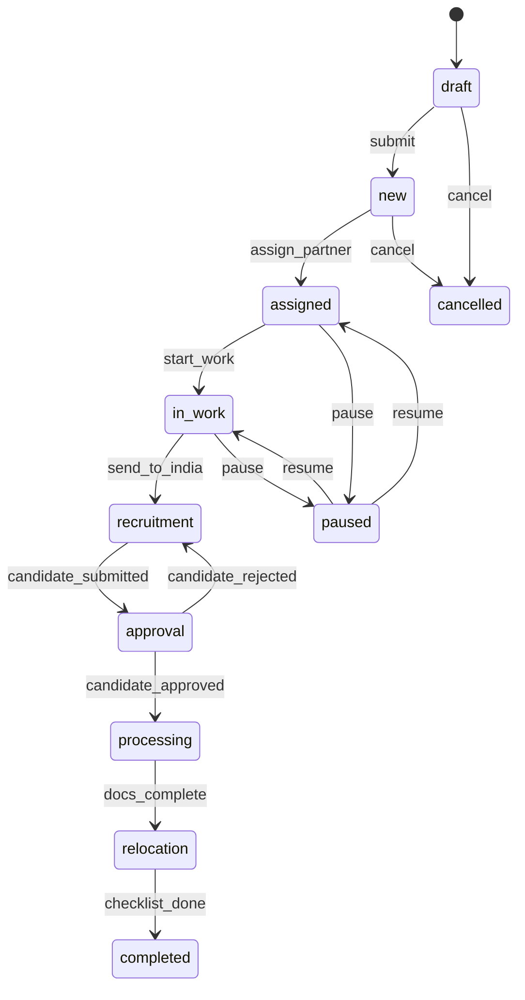

# Статусная модель заявки

## Диаграмма состояний

### v1 (MVP)



> [!info] Отличия v1 от полной модели
> В v1 статус «КП на рассмотрении» отсутствует. Подбор начинается сразу после «Взял в работу» (п. 2.33). Всё, что связано с согласованием КП, вынесено в Wave 4 (13.12 ФТ от 9.04).

### Wave 4 (полная модель)

В Wave 4 добавляется промежуточный статус **«КП на рассмотрении»** (13.12) между `assigned` и `in_work`:

```
... → assigned → КП_на_рассмотрении → in_work → recruitment → ...
```

## Маппинг внутренних статусов на клиентские

| Внутренний статус | Клиентский этап (v1) | Клиентский этап (Wave 4) |
|-------------------|----------------------|--------------------------|
| `draft`, `new`, `assigned` | Пресейл | Пресейл |
| `КП на рассмотрении` | — | КП на рассмотрении |
| `in_work` | Пресейл | В работе |
| (квотирование) | Квоты | Квоты |
| `recruitment` | Подбор | Подбор |
| `approval` | Согласование | Согласование |
| `processing` | Оформление | Оформление |
| `relocation` | Релокация | Релокация |
| `completed` | Готов к работе | Готов к работе |
| `paused` | Приостановлена | Приостановлена |
| `cancelled` | Отменена | Отменена |

Клиент видит только 6 упрощённых этапов в своём кабинете (v1).

## Блоки событий (40+)

| # | Блок | Примеры событий | Источник | Версия |
|---|------|-----------------|----------|--------|
| 1 | Создание | `deal_created`, `deal_submitted` | Админ | v1 |
| 2 | Назначение | `partner_assigned`, `partner_changed` | Админ | v1 |
| 3 | Пресейл / КП | `kp_calculated`, `kp_uploaded`, `kp_approved`, `kp_returned` | Система, Партнёр Индии, Админ | **Wave 4** |
| 4 | Задача Индии | `india_task_created`, `deadline_confirmed` | Партнёр РФ, Партнёр Индия | v1 |
| 5 | Подача кандидата | `candidate_submitted`, `docs_uploaded` | Партнёр Индия | v1 |
| 6 | Согласование | `candidate_approved`, `candidate_rejected`, `replacement_requested` | Клиент | v1 |
| 7 | Этапы оформления | `quota_submitted`, `rnr_issued`, `visa_issued` | Партнёр РФ | v1 |
| 8 | Релокация | `arrival_confirmed`, `registration_done` | Партнёр РФ | v1 |
| 9 | Чек-лист | `checklist_item_done`, `checklist_complete` | Партнёр РФ | v1 |
| 10 | Админ-действия | `deal_paused`, `deal_resumed`, `deal_cancelled` | Админ | v1 |

Каждое событие содержит:
- **Роль-источник** — кто инициирует
- **Переход статуса** — из какого в какой
- **Нотификации** — кому уходят уведомления (email / in-app)

> [!info] Блок КП (события КП) перенесён в Wave 4
> Согласно ФТ от 9.04 (D14), все события, связанные с согласованием КП (`kp_uploaded`, `kp_approved`, `kp_returned`, и связанные уведомления из п. 2.9–2.11, 2.21–2.23, 2.31, 2.34–2.37), перенесены в Wave 4 (раздел 13).

## Связи

- Визуализация pipeline — [[Pipeline сделки]]
- Сущность заявки — [[Заявка]]
