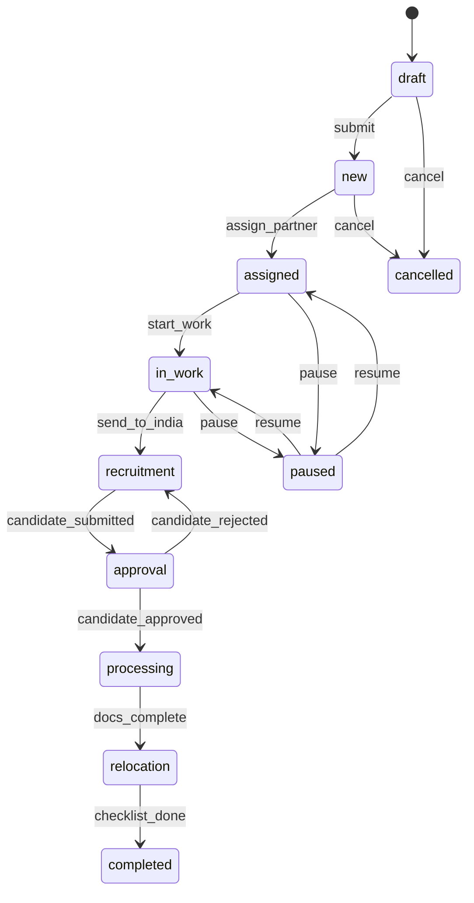

# Статусная модель заявки

## Диаграмма состояний

## Маппинг внутренних статусов на клиентские

| Внутренний статус | Клиентский этап |
|-------------------|-----------------|
| `draft`, `new`, `assigned`, `in_work` | Пресейл |
| (квотирование) | Квоты |
| `recruitment` | Подбор |
| `approval` | Согласование |
| `processing` | Оформление |
| `relocation` | Релокация |
| `completed` | Готов к работе |
| `paused` | Приостановлена |
| `cancelled` | Отменена |

Клиент видит только 6 упрощённых этапов в своём кабинете.

## Блоки событий (40+)

| # | Блок | Примеры событий | Источник |
|---|------|-----------------|----------|
| 1 | Создание | `deal_created`, `deal_submitted` | Админ |
| 2 | Назначение | `partner_assigned`, `partner_changed` | Админ |
| 3 | Пресейл / КП | `kp_uploaded`, `kp_approved`, `kp_returned` | Партнёр Индии, Админ |
| 4 | Задача Индии | `india_task_created`, `deadline_confirmed` | Партнёр РФ, Партнёр Индия |
| 5 | Подача кандидата | `candidate_submitted`, `docs_uploaded` | Партнёр Индия |
| 6 | Согласование | `candidate_approved`, `candidate_rejected`, `replacement_requested` | Клиент |
| 7 | Этапы оформления | `quota_submitted`, `rnr_issued`, `visa_issued` | Партнёр РФ |
| 8 | Релокация | `arrival_confirmed`, `registration_done` | Партнёр РФ |
| 9 | Чек-лист | `checklist_item_done`, `checklist_complete` | Партнёр РФ |
| 10 | Админ-действия | `deal_paused`, `deal_resumed`, `deal_cancelled` | Админ |

Каждое событие содержит:
- **Роль-источник** — кто инициирует
- **Переход статуса** — из какого в какой
- **Нотификации** — кому уходят уведомления (email / in-app)

## Связи

- Визуализация pipeline — [[Pipeline сделки]]
- Сущность заявки — [[Заявка]]
