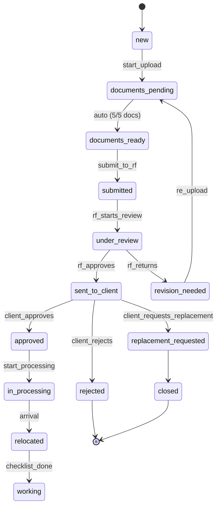

# Статусная модель кандидата

## Диаграмма состояний

## Ключевые переходы

- **Автопереход** `documents_pending → documents_ready` — срабатывает автоматически при загрузке 5 из 5 обязательных документов.
- **Отклонение** (`rejected`) — терминальный статус, клиент обязан указать причину.
- **Запрос замены** (`replacement_requested`) — кандидат закрывается, автоматически создаётся новая задача для Индии → новый цикл подбора.

## Цветовая кодировка

| Цвет | Статусы |
|------|---------|
| 🔵 Синий | `new`, `documents_pending`, `documents_ready` — подготовка |
| 🟡 Жёлтый | `submitted`, `under_review`, `sent_to_client`, `revision_needed` — на рассмотрении |
| 🟢 Зелёный | `approved`, `in_processing`, `relocated`, `working` — позитивный прогресс |
| 🔴 Красный | `rejected`, `replacement_requested`, `closed` — терминальные / негативные |

## Матрица видимости по ролям

| Статус | Партнёр Индия | Партнёр РФ | Клиент | Админ |
|--------|:---:|:---:|:---:|:---:|
| `new` – `documents_ready` | ✅ | ❌ | ❌ | ✅ |
| `submitted` – `under_review` | ✅ | ✅ | ❌ | ✅ |
| `sent_to_client` – `approved/rejected` | ✅ | ✅ | ✅ | ✅ |
| `in_processing` – `working` | ✅ | ✅ | ✅ | ✅ |

## Связи

- Сущность кандидата — [[Кандидат]]
- Процесс согласования — [[Согласование кандидата]]
