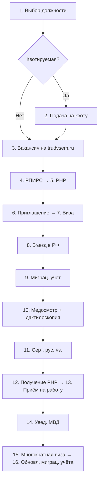

# Этапы оформления РНР

Критически важный регуляторный процесс для въезда индийских специалистов в РФ.

## 16 шагов

| # | Этап | Срок | Примечание |
|---|------|------|------------|
| 1 | Выбор должности | — | Квотируемая или неквотируемая |
| 2 | Подача на квоту | до 6 мес. | Только для квотируемых должностей |
| 3 | Вакансия на trudvsem.ru | — | Обязательная публикация на «Работа в России» |
| 4 | Получение РПИРС | 30 дней | Разрешение на привлечение иностранной рабочей силы |
| 5 | Оформление РНР | 30 дней | Основной документ — разрешение на работу |
| 6 | Рабочее приглашение | 15 раб. дней | Через МВД |
| 7 | Рабочая виза | 1–20 раб. дней | Оформляется в консульстве РФ в Индии |
| 8 | Въезд в РФ | — | Прибытие специалиста |
| 9 | Миграционный учёт | 7 раб. дней | С момента въезда |
| 10 | Медобследование + дактилоскопия | 30 дней с въезда | Обязательно для всех |
| 11 | Сертификат русского языка | 30 дней | Только для неквотируемых должностей |
| 12 | Получение РНР | — | Физическое получение документа |
| 13 | Приём на работу | — | Требуется ИНН + СНИЛС |
| 14 | Уведомление МВД о ТД | 3 дня | С даты заключения трудового договора |
| 15 | Переоформление визы в многократную | 20 раб. дней | Для возможности выезда / въезда |
| 16 | Обновление миграционного учёта | 3 дня | После переоформления визы |

## Визуализация

## Ограничения

- **Регион работы** — специалист может работать только в регионе, указанном в РНР.
- **Командировки** — суммарно не более 10 дней.
- **Зарплата** — не ниже МРОТ.

## Связи

- Квотирование — [[Квоты]]
- Место в pipeline — [[Pipeline сделки]]
- Чек-лист после въезда — [[Чек-лист оформления]]
